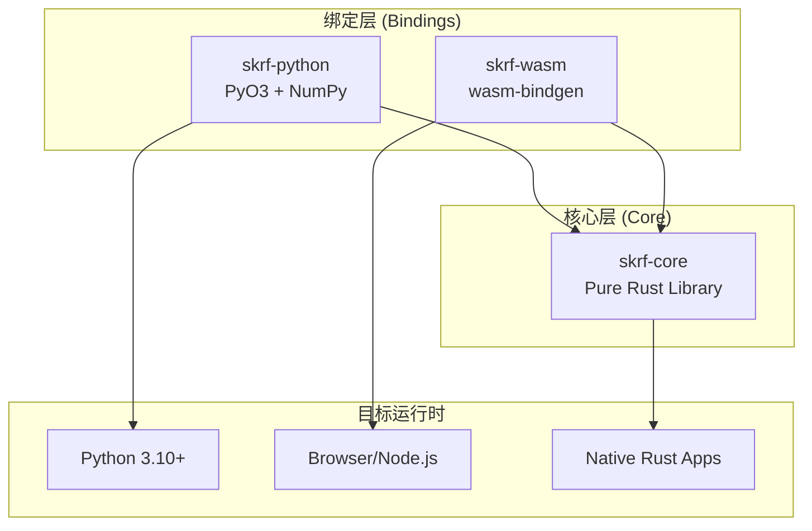
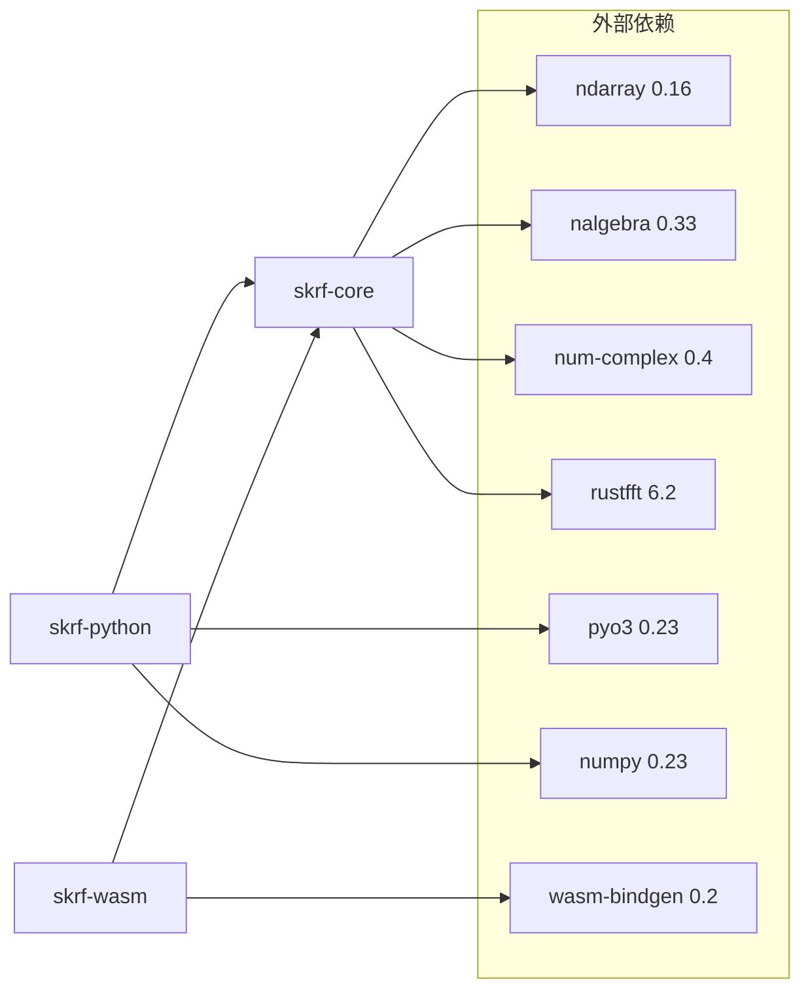

# rust-skrf 架构设计文档

> 本文档面向**人类开发者**和**AI Agent**，采用结构化格式以便机器解析和人类阅读。

## 1. 架构概览



## 2. 为什么分成三个 Crate？

### 2.1 核心问题

| 问题       | 单一 Crate 方案                      | 三 Crate 方案              |
| ---------- | ------------------------------------ | -------------------------- |
| 依赖膨胀   | PyO3/wasm-bindgen 对所有用户强制依赖 | 按需引入，核心库零绑定依赖 |
| 编译时间   | 全量编译，即使只改一行 Python 绑定   | 增量编译，改绑定不重编核心 |
| 二进制体积 | 包含所有绑定的冗余代码               | 每个目标只包含必要代码     |
| 测试隔离   | 绑定测试与核心测试混杂               | 各层独立测试，职责清晰     |

### 2.2 设计原则

```yaml
principle: "Write Once, Bind Twice"
rationale: |
  核心算法只实现一次，通过不同绑定层适配多个运行时。
  这不是代码复制，而是接口适配。

constraints:
  - skrf-core 不得依赖任何绑定框架 (PyO3, wasm-bindgen)
  - 绑定层只做数据转换，不实现业务逻辑
  - 新增功能只修改 skrf-core，绑定层自动获益
```

## 3. Crate 详解

### 3.1 skrf-core (核心库)

```toml
# 角色: 纯 Rust 库，所有算法的唯一实现
[dependencies]
num-complex = "0.4"    # 复数运算
ndarray = "0.16"       # N维数组
nalgebra = "0.33"      # 线性代数
rustfft = "6.2"        # FFT 变换
thiserror = "2.0"      # 错误类型
```

**职责边界:**

- ✅ Touchstone 文件解析/写入
- ✅ S/Z/Y/T/A/H 参数转换
- ✅ 网络级联、去嵌入、翻转
- ✅ 时域变换 (impulse/step response)
- ✅ Vector Fitting 算法
- ❌ 任何特定运行时的数据类型转换

**模块结构:**

```
skrf-core/src/
├── constants.rs      # 常量定义
├── frequency.rs      # 频率表示
├── math/            # 数学工具
├── network/         # N端口网络核心
├── touchstone/      # Touchstone I/O
└── vector_fitting/  # Vector Fitting
```

### 3.2 skrf-python (Python 绑定)

```toml
# 角色: Python 世界与 Rust 世界的桥梁
[lib]
crate-type = ["cdylib"]  # 编译为 .so/.pyd

[dependencies]
skrf-core = { path = "../skrf-core" }
pyo3 = { features = ["extension-module", "abi3-py310"] }
numpy = "0.23"
```

**职责边界:**

- ✅ `Rust Vec<Complex64>` ↔ `NumPy ndarray`
- ✅ `Rust Result<T>` → `Python Exception`
- ✅ 为 Python 用户提供符合习惯的 API
- ❌ 实现任何算法逻辑

**设计模式:**

```rust
// PyNetwork 是 skrf-core::Network 的薄封装
#[pyclass(name = "Network")]
pub struct PyNetwork {
    inner: skrf_core::Network,  // 组合，非继承
}

#[pymethods]
impl PyNetwork {
    // 转换 Rust 类型为 Python/NumPy 类型
    fn s_db<'py>(&self, py: Python<'py>) -> Bound<'py, PyArray3<f64>> {
        self.inner.s_db().to_pyarray(py)
    }
}
```

### 3.3 skrf-wasm (WebAssembly 绑定)

```toml
# 角色: 浏览器/Node.js 运行时适配
[lib]
crate-type = ["cdylib"]  # 编译为 .wasm

[dependencies]
skrf-core = { path = "../skrf-core" }
wasm-bindgen = "0.2"
js-sys = "0.3"
```

**职责边界:**

- ✅ `Rust Vec<f64>` → `Float64Array`
- ✅ 从字符串内容解析 Touchstone (无文件系统)
- ✅ 生成 TypeScript 类型定义
- ❌ 实现任何算法逻辑

**设计模式:**

```rust
#[wasm_bindgen]
pub struct WasmNetwork {
    inner: skrf_core::Network,
}

#[wasm_bindgen]
impl WasmNetwork {
    // 从文本内容创建，适配浏览器无文件系统场景
    #[wasm_bindgen(js_name = "fromTouchstoneContent")]
    pub fn from_touchstone_content(content: &str, filename: &str) -> Result<WasmNetwork, JsError> {
        // ...
    }
}
```

## 4. 依赖关系图



## 5. 构建产物

| Crate         | 产物类型 | 文件格式        | 使用场景       |
| ------------- | -------- | --------------- | -------------- |
| `skrf-core`   | `rlib`   | `.rlib`         | Rust 项目依赖  |
| `skrf-python` | `cdylib` | `.so` / `.pyd`  | Python import  |
| `skrf-wasm`   | `cdylib` | `.wasm` + `.js` | 浏览器/Node.js |

## 6. 复用指南 (给 AI Agent)

```yaml
when_to_use_this_pattern:
  - 核心逻辑需要跨多个运行时复用
  - 性能敏感，需要 Rust 实现
  - 目标平台包含 Python/WASM/Native

how_to_apply:
  step_1:
    action: "创建 workspace Cargo.toml"
    example: |
      [workspace]
      members = ["crates/core", "crates/python-bindings", "crates/wasm-bindings"]

  step_2:
    action: "在 workspace.dependencies 中声明共享依赖"
    rationale: "确保所有 crate 使用相同版本，避免重复编译"

  step_3:
    action: "core crate 只使用纯 Rust 依赖"
    forbidden: ["pyo3", "wasm-bindgen", "napi"]

  step_4:
    action: "绑定层依赖 core crate 并做类型转换"
    pattern: |
      pub struct PyFoo { inner: core::Foo }

anti_patterns:
  - name: '在 core 中使用 #[cfg(feature = "python")]'
    problem: "污染核心代码，增加复杂度"
    solution: "把 Python 特定代码放在 python-bindings crate"

  - name: "绑定层实现业务逻辑"
    problem: "逻辑分散，难以维护"
    solution: "绑定层只做数据转换，逻辑在 core 实现"
```

## 7. 目录结构模板

```
my-project/
├── Cargo.toml              # Workspace 定义
├── crates/
│   ├── my-core/           # 核心库
│   │   ├── Cargo.toml     # 无绑定依赖
│   │   └── src/
│   │       └── lib.rs
│   ├── my-python/         # Python 绑定
│   │   ├── Cargo.toml     # depends on my-core + pyo3
│   │   ├── pyproject.toml # maturin 配置
│   │   └── src/
│   │       └── lib.rs
│   └── my-wasm/           # WASM 绑定
│       ├── Cargo.toml     # depends on my-core + wasm-bindgen
│       └── src/
│           └── lib.rs
├── docs/
└── tests/
```

## 8. 常见问题

### Q: 为什么不用 feature flags 而是分 crate？

**A:** Feature flags 适合可选功能，不适合目标平台。原因：

1. **编译隔离**: PyO3 和 wasm-bindgen 有复杂的编译步骤，混在一起增加 CI 复杂度
2. **依赖冲突**: PyO3 需要 libpython，WASM 不能有本地依赖
3. **工具链差异**: Python 用 `maturin`，WASM 用 `wasm-pack`

### Q: 绑定层需要复制多少代码？

**A:** 接近零。绑定层只需要：

- 类型转换函数 (10-20 行/类)
- 错误转换函数 (5-10 行)
- 构造器和属性访问器

### Q: 如何保持 API 一致性？

**A:** 遵循命名约定：

```
Core:       Network::from_touchstone()
Python:     Network.from_touchstone()    # PyO3 自动转换
WASM:       WasmNetwork.fromTouchstone() # camelCase 适配 JS
```

---

_文档版本: 1.0.0 | 最后更新: 2025-12-13_
